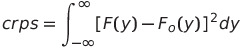
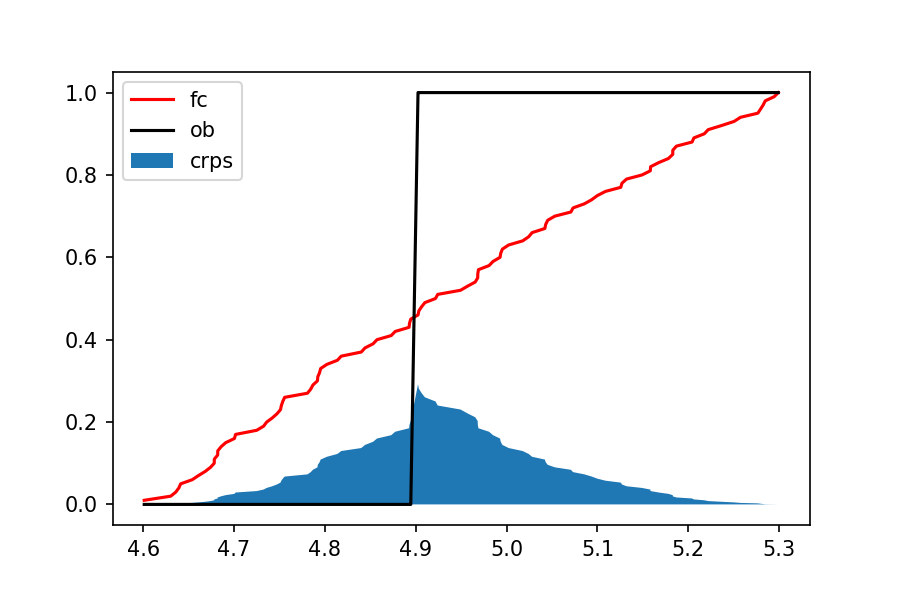

# Documentation  

A package to compute the continuous ranked probability score (crps) (Matheson and Winkler, 1976; Hersbach, 2000), the fair-crps (fcrps) (Ferro et al., 2008), and the adjusted-crps (acrps) (Ferro et al., 2008) given an ensemble prediction and an observation.
    
The CRPS is a negatively oriented score that is used to compare the empirical distribution of an ensemble prediction to a scalar observation. 

Read documentation at [https://github.com/garovent/CRPS](https://github.com/garovent/CRPS)

_References_:

[1] Matheson, J. E. & Winkler, R. L. Scoring Rules for Continuous Probability Distributions. Management Science 22, 1087–1096 (1976).

[2] Hersbach, H. Decomposition of the Continuous Ranked Probability Score for Ensemble Prediction Systems. Wea. Forecasting 15, 559–570 (2000).

[3] Ferro, C. A. T., Richardson, D. S. & Weigel, A. P. On the effect of ensemble size on the discrete and continuous ranked probability scores. Meteorological Applications 15, 19–24 (2008).

## _Installation:_

```sh
pip install CRPS
```

## _Parameters:_

**ensemble_members**: numpy.ndarray

The predicted ensemble members. They will be sorted in ascending order automatically.

Ex: np.array([2.1,3.5,4.7,1.2,1.3,5.2,5.3,4.2,3.1,1.7])

**observation**: float

The observed scalar.

Ex: 5.4
    
**adjusted_ensemble_size**: int, optional

The size the ensemble needs to be adjusted to before computing the Adjusted Continuous Ranked Probability Score. The default is 200. 

_Note_: The crps becomes equal to acrps when adjusted_ensemble_size equals the length of the ensemble_members.

## _Methods:_

**compute()**:

Computes the continuous ranked probability score (crps), the fair-crps (fcrps), and the adjusted-crps (acrps).

_Returns_:

crps,fcrps,acrps

## _Attributes:_

**cdf_fc**: 

Empirical cumulative distribution function ([CDF](https://en.wikipedia.org/wiki/Cumulative_distribution_function)) of the forecasts (y). F(y) in the crps equation.
   
**cdf_ob**:

CDF ([heaviside step function](https://en.wikipedia.org/wiki/Heaviside_step_function)) for the observation (o). It takes 0 for values is less than the observation, and 1 otherwise. F<sub>o</sub>(y) in the crps equation.
    
**delta_fc**:

dy term in the crps equation.
    
**crps**: Continuous Ranked Probability Score

It is the integral of the squared difference between the CDF of the forecast ensemble and the observation.



**fcrps**: Fair-Continuous Ranked Probability Score

It is the crps computed assuming an infinite ensemble size.


where m is the current ensemble size (i.e., len(ensemble_members))

**acrps**: Adjusted-Continuous Ranked Probability Score

It is the crps computed assuming an ensemble size of M.


where M is the adjusted_ensemble_size

## _Demonstration:_

```sh
import numpy as np
import CRPS.CRPS as pscore
```

Example - 1
```sh
In [1]: pscore(np.random.uniform(2,5,50),3.5).compute()
Out[1]: (0.24374216742963792, 0.2332762342590258, 0.23589271755167882)
```

Example - 2
```sh
In [2]: crps,fcrps,acrps = pscore(np.random.uniform(1.2,7,100),8.3,50).compute()
In [3]: crps
Out[3]: 3.11890267263096
In [4]: fcrps
Out[4]: 3.109573704801023
In [5]: acrps
Out[5]: 3.129164537243891
```

Example - 3
```sh
In [1]: fc = np.random.uniform(4.6,5.3,100)
In [2]: ob = 4.9
In [3]: ps = pscore(fc,ob)
In [4]: ps.compute()
Out[4]: (0.05767439558002044, 0.05651649413199454, 0.05709544485600749)
In [5]: import matplotlib.pyplot as plt
In [6]: plt.plot(ps.fc,ps.cdf_fc,'-r',label='fc')
   ...: plt.plot(ps.fc,ps.cdf_ob,'-k',label='ob')
   ...: plt.plot(ps.fc,(ps.cdf_fc-ps.cdf_ob)**2,'-b')
   ...: plt.fill_between(ps.fc,(ps.cdf_fc-ps.cdf_ob)**2,label='crps')
   ...: plt.legend()
Out[6]:
``` 



